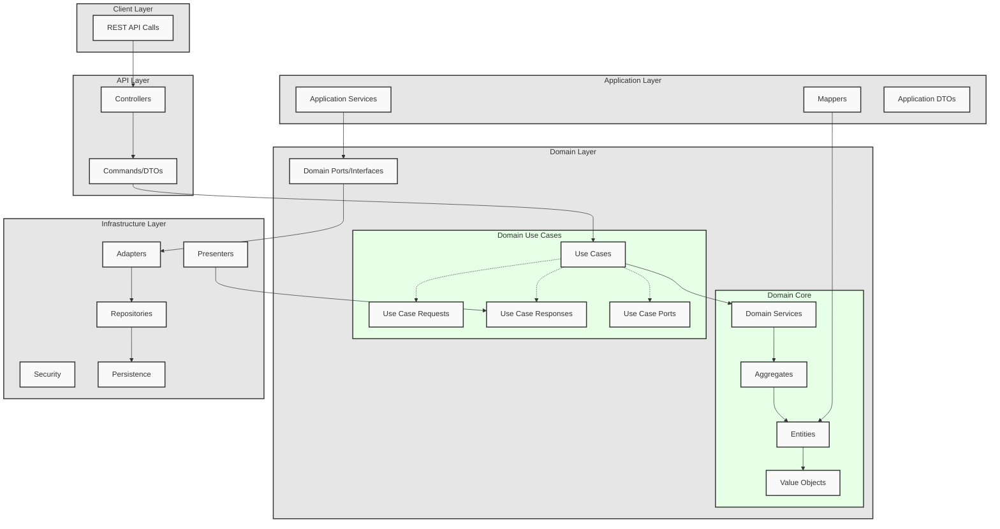

# Ravito Plan
Ravito Plan is a Java-based application designed to help endurance athletes plan their nutrition strategy for races and long-distance events. The name "Ravito" comes from "ravitaillement" (French for refreshment/refueling).

## Project Overview
This application helps athletes:
- Manage their race nutrition plan by creating checkpoints and planning food/drink intake
- Track races and their key metrics (distance, elevation, checkpoints)
- Manage a database of foods and brands commonly used in endurance sports
- Calculate nutrition needs based on race segments and checkpoints

## Learning Purpose
This project is intentionally over-engineered as a learning exercise to understand and implement clean architecture principles. While a simpler implementation could achieve the same functional results, the complex architecture serves to:

- Practice Domain-Driven Design patterns and principles
- Implement Hexagonal Architecture in a real-world scenario
- Demonstrate proper separation of concerns
- Explore design patterns and SOLID principles

The architecture choices reflect educational goals rather than production optimization.

## Technical Details
This project is built following Domain-Driven Design (DDD) and Hexagonal Architecture principles to ensure:

- Clear separation of concerns
- Business logic isolation in the domain layer
- Flexible and maintainable codebase
- Easy testing and adaptability

## Architecture Layers

**API**: REST endpoints for handling HTTP requests
**Application:** Application services, DTOs, and use case orchestration
**Domain:** Core business logic, entities, and domain services
**Infrastructure:** Technical implementations (database, security, external services)

## Key Features

- User authentication and registration
- Race management (CRUD operations)
- Checkpoint handling with elevation and distance tracking
- Food and brand management
- Nutrition planning per checkpoint
- Segment calculations between checkpoints

## Tech Stack

- Java
- Spring Boot
- Spring Security
- JPA/Hibernate

## License

This project is licensed under the GNU Affero General Public License v3.0 (AGPL-3.0).
